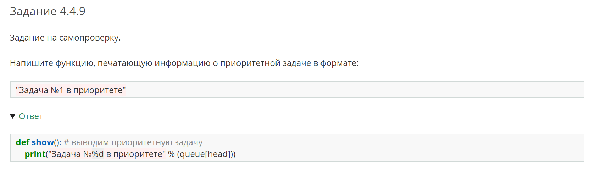

# МОДУЛЬ C2

---

## Юнит C2.2

---

### Правка 1:

Скриншот с местом правки: 
<br>

<kbd></kbd>

<ins>Заменить блок с кодом на </ins>

```python
class StaticClass:

    @staticmethod # помечаем метод который мы хотим сделать статичным декоратором @staticmethod
    def bar():
        print("bar")

StaticClass.bar()
```

---

### Правка 2:

Скриншот с местом правки: 
<br>

<kbd></kbd>

<ins>Заменить блок с кодом на  </ins>

```python
class StaticClass:

    @staticmethod
    def bar():
        print("bar")

f = StaticClass()
f.bar() # вызывать статические методы через объекты так же никто не запрещает
```

---

### Правка 3:

Скриншот с местом правки: 
<br>

<kbd></kbd>

<ins>Заменить блок с кодом на</ins>

```python
class StaticClass:

    @staticmethod
    def GET_BAR(): # вспоминаем, что константа пишется со всеми заглавными буквами (в простонародье - капсом)
        return "bar"

print(StaticClass.GET_BAR())
```

---

### Правка 4:

Скриншот с местом правки: 
<br>

<kbd></kbd>

<ins> **Задание 2.2.4** в спойлере с ответом заменить блок с кодом на </ins>

```python
class Square:
    def __init__(self, side):
        self.side = side

class SquareFactory:
    @staticmethod
    def create_square(side):
        return Square(side)

sq1 = SquareFactory.create_square(1)
print(sq1.side)
```

---

## Юнит C2.3

---

### Правка 5:

Скриншот с местом правки: 
<br>

<kbd></kbd>

<ins>Беда с отступами, нужно заменить блок кода на </ins>

```python
# создадим класс собаки
class Dog:
    def __init__(self, name, age):
        self.name = name
        self.age = age

    # создадим свойство human_age, которое будет переводить возраст животного в человеческий
    @property  # тот самый магический декоратор
    def human_age(self):
        return self.age * 7.3


jane = Dog("jane", 4)
# т.к. метод помечен декоратором property, то нам не надо вызывать этот метод чтобы получить результат
print(jane.human_age)
```

---

### Правка 6:

Скриншот с местом правки: 
<br>

<kbd></kbd>

<ins>Беда с отступами, нужно заменить блок кода на </ins> 

```python
class Dog:
    _happiness = 10

    def __init__(self, name, age):
        self.name = name
        self.age = age

    @property
    def human_age(self):
        return self.age * 7.3

    # добавим новое поле - шкала счастья
    @property
    def happiness(self):
        return self._happiness

    # с помощью декоратора setter мы можем неявно передать во второй аргумент значение, находящееся справа от равно, а не закидывать это значение в скобки, как мы это делали в 15м модуле, когда не знали о декораторах класса
    @happiness.setter
    # допустим мы хотим, чтобы счастье питомца измерялось шкалой от 0 до 100
    def happiness(self, value):
        if value <= 100 and value >= 0:
            self._happiness = value
        else:
            raise ValueError("Happiness must be between 0 ... 100")


jane = Dog("jane", 4)
jane.happiness = 100  # осчастливим нашу собаку < :
print(jane.happiness)
```

---

## Юнит C2.4

---

### Правка 7:

Скриншот с местом правки: 
<br>

<kbd></kbd>

<ins>Нужно заменить блок кода на  </ins>

```python
print("Перед исключением")
# теперь пользователь сам вводит числа для деления
a = int(input("a: "))
b = int(input("b: "))
c = a / b  # здесь может возникнуть исключение деления на ноль
print(c)  # печатаем c = a / b если всё хорошо
print("После исключения")
```

---

### Правка 8:

Скриншот с местом правки: 
<br>

<kbd></kbd>

<ins>Нужно заменить блок кода на</ins>

```python
try:
    age = int(input("How old are you?"))

    if age > 100 or age <= 0:
        raise ValueError("Тебе не может быть столько лет")

    # Возраст выводится только если пользователь ввёл правильный возраст.
    print(f"You are {age} years old!")
except ValueError:
    print("Неправильный возраст")

```

---

### Правка 9:

Скриншот с местом правки: 
<br>

<kbd></kbd>

<ins>В **Задании 2.4.7** правильным является первый ответ, а не второй.</ins>

---

## Юнит C2.5

---

### Правка 10:
Скриншот с местом правки: 
<br>

<kbd></kbd>

<ins>Нужно **4 и 5 пункты** заменить на: </ins>

> 4. Для представления корабля на игровой доске напишите класс Ship (в конструктор передаём информацию о его положении на доске).
> 5. Опишите класс доски, на которую будут размещаться корабли.  

---

### Правка 11:
В примере вывода игрового поля
<br>

<kbd></kbd>

<ins>Нужно поменять несколько символов местами, чтобы правый верхний корабль был на одну клетку правее:</ins>
<br>

<kbd></kbd>

<ins>И то же самое сделать для следующего поля, чтобы стало:</ins>
<br>

<kbd></kbd>

---

### Правка 12

Скриншот с местом правки: 
<br>

<kbd></kbd>

<ins>В самом конце, после 11 пункта и перед формой с заданием, нужно сделать спойлер с названием **"Алгоритм решения практического задания"**. Содержимое спойлера сделать таким:</ins>

Решать задачу будем последовательной реализацией нужных классов. Во многих случаях правильное разбиение кода на классы делает ваш код хорошо читаемым и экономит очень много времени.
Можно выделить две группы классов:
1. Внутренняя логика игры - корабли, игровая доска и вся логика связанная с ней.
2. Внешняя логика игры - пользовательский интерфейс, искусственный интеллект, игровой контроллер, который считает побитые корабли.


В начале имеет смысл написать классы исключений, которые будет использовать наша программа. Например, когда игрок пытается выстрелить в клетку за пределами поля, во внутренней логике должно выбрасываться соответствующее исключение `BoardOutException`, а потом отлавливаться во внейшней логике, выводя сообщение об этой ошибке пользователю.

Далее нужно релизовать **класс `Dot`** - класс точек на поле. Каждая точка описывается параметрами:
1. Координата по оси `x` .
2. Координата по оси `y` .

В программе мы будем часто обмениваться информацией о точках на поле, поэтому имеет смысле сделать отдельный тип данных дня них. Очень удобно будет реализовать в этом классе метод `__eq__`, чтобы точки можно было проверять на равенство. Тогда, чтобы проверить, находится ли точка в списке, достаточно просто использовать оператор `in` , как мы делали это с числами .

Следущим идёт **класс `Ship`** - корабль на игровом поле, который описывается параметрами:
1. Длина.
2. Точка, где размещён нос корабля.
3. Направление корабля (вертикальное/горизонтальное)
4. Количеством жизней (сколько точек корабля еще не подбито).

И имеет методы:
1. Метод `dots`, который возвращает список всех точек корабля.


Самый важный класс во внутренней логике - **класс `Board`** - игровая доска. Доска описывается параметрами:
1. Двумерный списк, в котором хранятся состояния каждой из клеток.
2. Список кораблей доски.
3. Параметр `hid` типа `bool` - информация о том, нужно ли скрывать корабли на доске (для вывода доски врага), или нет (для своей доски).
4. Количество живых кораблей на доске.

И имеет методы:
1. Метод `add_ship` , который ставит корабль на доску (если ставить не получается, выбрасываем исключения). 
2. Метод `contour`, который обводит корабль по контуру. Он будет полезен и в ходе самой игры, и в при расстановке кораблей (помечает соседние точки, где корабля по правилам быть не может).
3. Метод, который выводит доску в консоль в зависимости от параметра `hid`.
4. Метод `out`, который для точки (объекта класса `Dot`) возвращает `True`, если точка выходит за пределы поля, и `False`, если не выходит.
8. Метод `shot`, который делает выстрел по доске (если есть попытка выстрелить за пределы и в использованную точку, нужно выбрасывать исключения).   

Теперь нужно заняться внешней логикой:
**Класс `Player`** - класс игрока в игру (и AI, и пользователь). Этот класс будет родителем для классов с AI и с пользователем. Игрок описывается параметрами:
1. Собственная доска (объект класса `Board`)
2. Доска врага.

И имеет следующие методы:
1. `ask` - метод, который "спрашивает" игрока, в какую клетку он делает выстрел. Пока мы делаем общий для AI и пользователя класс, этот метод мы описать не можем. Оставим этот метод пустым. Тем самым обозначим, что потомки должны реализовать этот метод.
2. `move` - метод, который делает ход в игре. Тут мы вызываем метод `ask`, делаем выстрел по вражеской доске (метод `Board.shot`), отлавливаем исключения, и если они есть, пытаемся повторить ход. Метод должен возвращать `True`, если этому игроку нужен повторный ход (например если он выстрелом подбил корабль).

Теперь нам остаётся унаследовать **классы `AI` и `User` от `Player`** и переопределить в них метод `ask`. Для `AI` это будет выбор случайной точка, а для `User` этот метод будет спрашивать кординаты точки из консоли.

После создаём наш главный класс - **класс `Game`**. Игра описывается параметрами:
1. Игрок-пользователь, объект класса `User`.
2. Доска пользователя.
3. Игрок-компьютер, объект класса `Ai`.
4. Доска компьютера.

И имеет методы:
1. `random_board` - метод генерирует случайную доску. Для этого мы просто пытаемся в случайные клетки изначально пустой доски расставлять корабли (в бесконечном цикле пытаемся поставить корабль в случайную току, пока наша попытка не окажется успешной). Лучше расставлять сначала длинные корабли, а потом короткие. Если было сделано много (несколько тысяч) попыток установить корабль, но это не получилось, значит доска неудачная и на неё корабль уже не добавить. В таком случае нужно начать генерировать новую доску.
2. `greet` - метод, который в консоли приветствует пользователя и рассказывает о формате ввода.
3. `loop` - метод с самим игровым циклом. Там мы просто последовательно вызываем метод `mode` для игроков и делаем проверку, сколько живых кораблей осталось на досках, чтобы определить победу.
4. `start` - запуск игры. Сначала вызываем `greet`, а потом `loop`.

И останется просто создать экземпляр класса `Game` и вызвать метод `start`.

По ходу написания кода полезно проверять свой прогресс, тестируя написанные классы по отдельности. Для этого можно моделировать различные ситуации, например, создать список кораблей, добавить их на доску и попробовать сделать выстрел в разные точки. Для проверки функционала класса не обязательно иметь весь написанный код.


---

# МОДУЛЬ C4

---

## Юнит C4.4

---

### Правка 13:

Скриншот с местом правки: 
<br>

<kbd></kbd>

<ins>Весь блок кода (прямо перед Заданием 4.4.6) надо заменить на</ins>

```python
# Создадим класс Queue - нужная нам очередь
class Queue:
    # Конструктор нашего класса, в нём происходит нужная инициализация объекта
    def __init__(self, max_size):
        self.max_size = max_size # размер очереди
        self.task_num = 0 # будем хранить сквозной номер задачи

        self.tasks = [0 for _ in range(self.max_size)] # инициализируем список с нулевыми элементами
        self.head = 0 # указатель на начало очереди
        self.tail = 0 # указатель на элемент следующий за концом очереди
    
    # !!! Класс далее нужно дополнить методами !!!


# Используем класс
size = int(input("Определите размер очереди: "))
q = Queue(size)

while True:
    cmd = input("Введите команду:")
    if cmd == "empty": 
        if q.is_empty():
            print("Очередь пустая")
        else:
            print("В очереди есть задачи")
    elif cmd == "size":
        print("Количество задач в очереди:", q.size())
    elif cmd == "add": 
        if q.size() != q.max_size:
            q.add()
        else:
            print("Очередь переполнена")
    elif cmd == "show": 
        if q.is_empty():
            print("Очередь пустая")
        else:
            q.show()
    elif cmd == "do": 
        if q.is_empty():
            print("Очередь пустая")
        else:
            q.do()
    elif cmd == "exit": 
        for _ in range(q.size()):
            q.do()
        print("Очередь пустая. Завершение работы")
        break
    else:
        print("Введена неверная команда")
```

---

### Правка 14:

Скриншот с местом правки: 
<br>

<kbd></kbd>

<ins>В **задании 4.4.6** надо условие поменять на </ins>

> Добавьте в класс `Queue` метод `is_empty`, который проверяет наличие элементов в очереди, используя указатели `head` и `tail`. Запрещается использование функции `len(list_)`, так как ее сложность O(n).  

<ins>А код в **ответе** на:</ins>

```python
    def is_empty(self):  # очередь пуста?
        # да, если указатели совпадают и в них содержится ноль
        return self.head == self.tail and self.tasks[self.head] == 0
```

---

### Правка 15:

Скриншот с местом правки: 
<br>

<kbd></kbd>

<ins>В **задании 4.4.7** надо условие поменять на</ins> 

> Добавьте в класс `Queue` метод `size`, который возвращает текущий размер очереди. Учтите, что необходимо рассмотреть несколько случаев: когда очередь пустая, когда очередь полная (какому условию соответствует?), а также отдельное внимание стоит обратить на тот случай, когда хвост очереди переместился в начало списка (закольцевался).

<ins>А код в **ответе** на:</ins>

```python
    def size(self):  # получаем размер очереди
        if self.is_empty():  # если она пуста
            return 0  # возвращаем ноль
        elif self.head == self.tail:  # иначе, если очередь не пуста, но указатели совпадают
            return self.max_size  # значит очередь заполнена
        elif self.head > self.tail:  # если хвост очереди сместился в начало списка
            return self.max_size - self.head + self.tail
        else:  # или если хвост стоит правее начала
            return self.tail - self.head
```

---

### Правка 16:

Скриншот с местом правки: 
<br>

<kbd></kbd>

<ins>В **задании 4.4.8** надо условие поменять на </ins>

> Добавьте в класс `Queue` метод `add`, который добавляет задачу в конец очереди. Также учтите, что размер массива ограничен и при достижении этого предела, необходимо перенести указатель в положение 0. Также обратите внимание на области видимости переменных `tail` и `order`. После добавления задачи в очередь, она должна вывести уведомление об этом в формате: 

<ins>А код в **ответе** на:</ins>

```python
    def add(self):
        self.task_num += 1  # увеличиваем порядковый номер задачи
        self.tasks[self.tail] = self.task_num  # добавляем его в очередь
        print(f"Задача №{self.tasks[self.tail]} добавлена")

        # увеличиваем указатель на 1 по модулю максимального числа элементов
        # для зацикливания очереди в списке
        self.tail = (self.tail + 1) % self.max_size
```

---

### Правка 17:

Скриншот с местом правки: 
<br>

<kbd></kbd>

<ins>В **задании 4.4.9** надо условие поменять на </ins>

> Добавьте в класс `Queue` метод `show`, печатающий информацию о приоритетной задаче в формате
> ```python
> "Задача №1 в приоритете"
> ```

<ins>А код в **ответе** на:</ins>

```python
    def show(self):  # выводим приоритетную задачу
        print(f"Задача №{self.tasks[self.head]} в приоритете")
```

---

### Правка 18:

Скриншот с местом правки: 
<br>

<kbd></kbd>

<ins>В **задании 4.4.10** надо условие поменять на </ins>

> Добавьте в класс `Queue` метод `do` , которая печатает в консоль задачу (=выполняет ее) и, соответственно, удаляет ее из очереди, присваивая ей значение 0. Формат вывода:
> ```python
> "Задача №1 выполнена"
> ```

<ins>А код в **ответе** на:</ins>

```python
    def do(self):  # выполняем приоритетную задачу
        print(f"Задача №{self.tasks[self.head]} выполнена")
        # после выполнения зануляем элемент по указателю
        self.tasks[self.head] = 0
        # и циклично перемещаем указатель
        self.head = (self.head + 1) % self.max_size
```

---

### Правка 19:

<ins>В **задании 4.4.11** нужно поменять ответы (указал два возможных ответа)</ins>

```
7,8,9,10
7, 8, 9, 10
```
